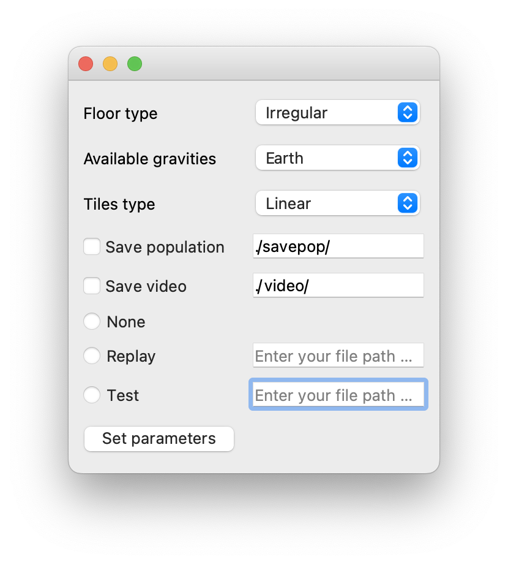

# Hot Genetic Wheels

This repo contains for the project group of the course Bio-Inspired Artificial Intelligence held at the University of Trento.

## Installation

#### Windows

1. `git clone https://github.com/pybox2d/pybox2d`
2. Download SWIG
3. Unzip and add `swigwin-4.0.1` to your `System Variables PATH` (environment variable).
4. `cd /path/to/pybox2d/clone/location`
5. `python setup.py build`
6. `python setup.py install`

#### Linux

1. `sudo apt-get install swig`
2. `git clone https://github.com/pybox2d/pybox2d`
3. `cd /path/to/pybox2d/clone/location`
4. `python setup.py build`
5. `sudo python setup.py install`

#### MacOS

1. `brew install swig`
2. `git clone https://github.com/pybox2d/pybox2d`
3. `cd /path/to/pybox2d/clone/location`
4. `python setup.py build`
5. `sudo python setup.py install`

#### Common steps

To test open a new Python terminal:` `

1. `import Box2D`
2. `Box2D.__version__`

If everything goes right, you should see a version printed.` `
You can now run `pip3 install -r requirements.txt` to finish installing the below requirements:

1. numpy
2. pyqt5
3. dill

## Code

The code is composed of:

* boxcar directory: contains all the file for car, wheel and floor managment
* genetic_algorithm directory: contains all the files that regars the GAs (crossover, mutation, selection) and the population
* settings.py: contains all the information about the GA and graphics stuff
* windows.py: contains the classes that draw the windows of the second window
* PyGenoCar.py: is the main file

## How to run

To test the code, you just need to run the PyGenoCar.py file, and a window will open where you can select the environment's features, such as the type of flooring, the gravity of the environment, and the shape of the tile.

Afterwards, there are options for saving the generated populations, video recording, replay, and testing.

When you click the "Set Parameters" button, the world will be generated, and you will see your population within it.

In the second window, you will notice multiple interface elements. There is a main window where you can see the cars moving on the selected track.

In the bottom left corner, there is a window that displays all the key features of the Genetic Algorithm.

In the top right corner, there is a chart that represents the colors assigned to the chassis and wheels based on their density. In the bottom right corner, there are settings related to the car.

